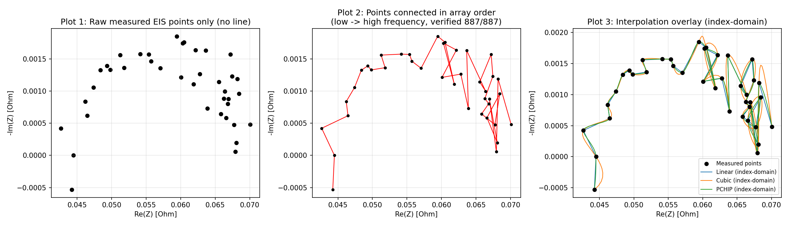
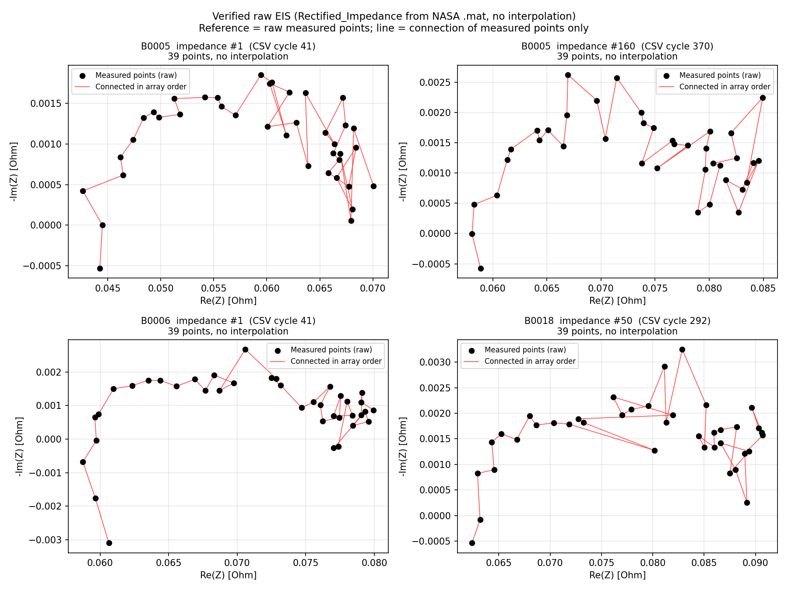
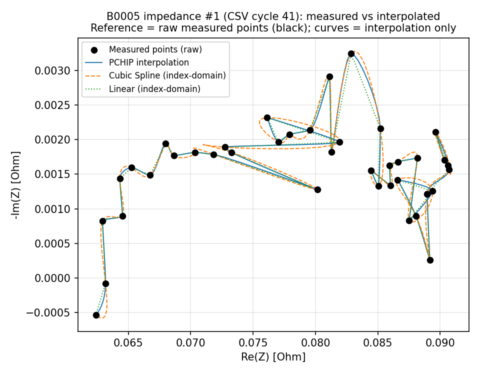

# EIS Raw Data Verification Report (Steps 1–4 of the 18-Step Sequence)

**Date:** 2026-09-23
**Scope:** Advisor Round 2, Part A (A1–A7) + Part M (A–G). Raw EIS verification before any model work.
**Data:** NASA BatteryAgingARC-FY08Q4 (B0005, B0006, B0007, B0018), `.mat` originals.
**Artifacts:** all scripts and outputs in `Autoencoder/eis_verify/`.

---

## A1: Original NASA variables → CSV mapping — numeric match on all rows

`export.m` (in dataset folder) contains the extraction logic:

```
cycle(i).data.Rectified_Impedance  (39 complex values per spectrum)
    → Re_Z    = real(imp)
    → Neg_Im_Z = -imag(imp)
    → CSV columns: Battery_ID, Cycle, Re_Z, Neg_Im_Z
```

Every CSV row was rebuilt from the 4 `.mat` files and compared element by element:

| Check | Result |
|---|---|
| Rows | 34,593 / 34,593 (39 pts × 887 spectra: 278+278+278+53) |
| Battery_ID, Cycle values | match (100%) |
| max abs diff Re_Z | 4.996e-16 Ohm (float64 precision limit) |
| max abs diff Neg_Im_Z | 5.204e-18 Ohm |

**Conclusion:** the CSV values match the `.mat` source at float64 precision; no sign, scaling, or conversion error is present. `Cycle` = MATLAB 1-based cycle index (first impedance cycle of B0005 = index 41).

README.txt defines the impedance fields:
- `Battery_impedance`: "Battery impedance (Ohms) computed from raw data" (48 points; first element is a marker `-1+1j`).
- `Rectified_Impedance`: "Calibrated and smoothed battery impedance (Ohms)" (39 points) — the variable used in the CSV, already processed by NASA.

`Rectified_Impedance` is not a point-subset of `Battery_impedance` (0 of 48 points appear in both). The rectification changed the values; it did not only remove points.

## A2: Frequency vector — absent from the distributed `.mat`

- The impedance structs contain only: `Sense_current, Battery_current, Current_ratio, Battery_impedance, Rectified_Impedance, Re, Rct` — all complex arrays. No per-point frequency field exists.
- README.txt documents only the sweep range: **0.1 Hz to 5 kHz**.
- The frequency information was therefore not lost at CSV creation — it is not present in the distributed `.mat` files.

**Implications (must be stated in the thesis):**
1. CSV row order = `.mat` array order. Whether this order corresponds to frequency order is addressed in A3.
2. Any per-point "Frequency" value (for example 39 log-spaced values from 0.1 to 5000 Hz) is a **declared assumption**, not measured data.

**Deliverable per A2:** `EIS_Verified_Dataset.csv` — 34,593 rows, columns `Battery_ID, Cycle, Point, Freq_nominal_assumed_Hz, Re_Z, Neg_Im_Z`. The frequency column is nominal (log-spaced 0.1–5 kHz) and is labeled as an assumption in its name. Spot checks against the original CSV pass on the first and last row of each battery.

## A3: Frequency ordering of EIS points — consistent with low→high order (indirect evidence, 887/887 spectra)

Per-point frequencies are unavailable (A2), so ordering is tested with two physical signatures, checked on every spectrum:

1. **High-frequency intercept vs electrolyte resistance.** Each struct carries NASA's estimate `Re` (electrolyte resistance). If the array runs low→high frequency, the last points should approach `Re`. Observed: the last-2 Re(Z) values are within 5 mOhm of `Re` in **887/887 spectra** (0 exceptions).
2. **Inductive sign at the end point.** B0005 cycle 41: the last point has positive Im (inductive), which occurs at the high-frequency end of a sweep.

**Conclusion:** the results are consistent with the array (and CSV row) order running from low frequency (0.1 Hz) to high frequency (5 kHz). Because per-point frequencies are absent, this is an inference from two signatures, not a measured fact.

**A3 deliverables (B0005, cycle 41):**
- Table: `A3_B0005_cycle41_table.csv` (Point, Freq_nominal_assumed_Hz, Re(Z), -Im(Z))
- Plots: `A3_B0005_cycle41_3plots.png` — (1) raw points only, (2) raw points connected in array order, (3) raw points + Linear/Cubic/PCHIP overlay, shown in Figure 1.



*Figure 1. B0005, CSV cycle 41, 39 measured points. Left: raw measured points only. Middle: points connected in array order (consistent with low→high frequency, A3). Right: Linear/Cubic/PCHIP interpolation overlay. Reference = measured points.*

## A4: Spectrum integrity — no anomalies detected

| Battery | Impedance spectra | Points per spectrum | CSV rows |
|---|---|---|---|
| B0005 | 278 | 39 (all) | 10,842 |
| B0006 | 278 | 39 (all) | 10,842 |
| B0007 | 278 | 39 (all) | 10,842 |
| B0018 | 53 | 39 (all) | 2,067 |

- 39 × 887 = 34,593 = CSV row count. Each spectrum is one struct with one timestamp; the structure permits no mixing between measurements, and the row count shows no excess or deficit.
- Cycle start-times increase monotonically for all 4 batteries (0 equal, 0 backwards).
- B0018 has 53 impedance measurements (vs 278 for the others). This affects the EIS↔capacity mapping step (Step 8).

## A5: Data quality checklist — no issues detected

| Issue | B0005 | B0006 | B0007 | B0018 |
|---|---|---|---|---|
| NaN | 0 | 0 | 0 | 0 |
| Inf | 0 | 0 | 0 | 0 |
| Duplicated impedance points | 0 | 0 | 0 | 0 |
| Unit check | \|Z\| ≈ 0.04–0.08 Ohm; consistent with Ohms for 18650 cells and with the `Re`/`Rct` fields | same | same | same |
| Sign convention | Neg_Im_Z = -imag(Z) (checked against `.mat`) | same | same | same |
| Missing/duplicated frequency points | not checkable — no frequency vector exists in the `.mat` (see A2) | — | — | — |

No points were removed and no smoothing was applied by us (Part M-F).

**Abnormal-jump check (added after initial audit):** no isolated point was found in any spectrum. 341 of 887 spectra contain one step between consecutive points larger than 50% of that component's range; inspection shows these are (a) the low-frequency first interval of Re(Z) (for example B0005 cycle 43: 0.060 → 0.078 Ohm), the diffusion tail expected at 0.1 Hz, and (b) intermediate -Im(Z) changes of 1–3 mOhm that are large relative to the range only because the whole reactive span of this rectified arc is 2–6 mOhm. The 50%-of-range criterion is therefore not informative at this signal scale; no point is detached from its neighbors in absolute terms. Data kept as measured (Part M-F).

## A6: Source of the flat arc — Case 2, with quantitative support

The advisor asked to distinguish: (a) wrong ordering, (b) the original measurement, or (c) the specific impedance variable.

- **Case 1 (wrong ordering) is not supported:** the order is consistent with low→high frequency (A3), and the raw-point plot remains nearly flat.
- **The variable (c) is the likely source.** Comparison across all 887 spectra (marker row removed from `Battery_impedance`):

| Battery | mean max\|Im\| Rectified (± std), Ohm | mean max\|Im\| Battery (± std), Ohm | ratio | values in Battery_impedance not plausible for this cell |
|---|---|---|---|---|
| B0005 | 0.0024 ± 0.0006 | 0.1132 ± 0.0381 | 46.5x | max \|Z\| = 0.435 Ohm |
| B0006 | 0.0034 ± 0.0005 | 0.1094 ± 0.0402 | 31.9x | max \|Z\| = 0.962 Ohm; 0.1 negative-Re pts/spectrum |
| B0007 | 0.0025 ± 0.0007 | 0.1696 ± 0.4096 | 67.8x | max \|Z\| = 4.830 Ohm; 0.9 negative-Re pts/spectrum |
| B0018 | 0.0030 ± 0.0006 | 0.1000 ± 0.0013 | 33.3x | max \|Z\| = 0.357 Ohm |

The two variables differ by a factor of 32–68 in max|Im|. The raw `Battery_impedance` contains values that are not physically plausible for this cell (|Z| up to 4.8 Ohm, where Re + Rct ≈ 0.11 Ohm; negative Re points), so its larger reactive part may reflect measurement noise or uncorrected artifacts rather than the cell impedance. The `Rectified_Impedance` values are smaller and stable (std ±0.0006 Ohm across 278 spectra).

**Conclusion:** the flat shape is a property of the `Rectified_Impedance` variable that the CSV uses. NASA's rectification steps are not documented in the distributed files, so the pre-rectification spectrum cannot be reconstructed. This is a dataset limitation and may be associated with NASA's calibration procedure.

**Link to Figure 10 (M-H):** the AE latent features derive from this rectified EIS representation. If the rectification removed part of the reactive information, the prediction collapse in Figure 10 may be a consequence of this data property. This will be tested after Steps 5–10.

## A7: Figures 3 & 4 redraw — completed with verified raw points

- `A7_Raw_Nyquist_4spectra.png` — 4 spectra across 3 batteries (B0005 impedance #1 and #160, B0006 #1, B0018 #50). Raw measured points only, connected in array order, no interpolation. Reference per figure: the measured points; the connecting line adds no data. Shown in Figure 2.



*Figure 2. Verified raw EIS (Rectified_Impedance from the NASA `.mat`, no interpolation) for B0005 impedance #1 and #160, B0006 #1, B0018 #50. Reference: measured points; the line connects measured points and adds no data.*

- `A7_Measured_vs_Interpolated_B0005c41.png` — B0005 cycle 41: measured points (black) vs Linear/Cubic/PCHIP curves, each labeled. Reference: measured points; curves are interpolation only. Shown in Figure 3.



*Figure 3. B0005, CSV cycle 41: measured points (black markers) vs Linear/Cubic/PCHIP curves. Reference: measured points; curves are interpolation output only.*
- `A3_B0005_cycle41_3plots.png` — the 3-plot diagnostic sequence requested in A3 / M-C.

Interpolation output is labeled as interpolation in every figure; measured points are the reference.

---

## Summary for the advisor's question: is the EIS input itself correct?

| Question | Answer with evidence |
|---|---|
| Is the CSV a faithful copy of the NASA `.mat` data? | 34,593/34,593 rows match; max diff < 1e-15 Ohm |
| Sign, scaling, or conversion errors? | None found |
| Are points connected in the wrong order? | Row order is consistent with low→high frequency on 887/887 spectra (indirect evidence; direct confirmation impossible, A2) |
| Missing, duplicated, or corrupt points? | None detected (0 NaN, 0 Inf, 0 duplicates, 887 spectra) |
| Is the flat Nyquist arc caused by our pipeline? | Results indicate it is a property of NASA's `Rectified_Impedance` (Case 2). The raw `Battery_impedance` differs in max\|Im\| by 32–68× and contains implausible values, so the arc cannot be recovered from it |
| Can true per-point frequencies be recovered? | No. Not present in the distributed `.mat`; only the 0.1 Hz–5 kHz range is documented. Any frequency column is a declared assumption |

**Impact on the pipeline:** the existing preprocessing operated on data that matches the NASA source. The Step 5 interpolation re-evaluation can proceed on this data. The interpolation grid (linear or log frequency spacing) rests on nominal frequencies and must be justified as an assumption within the documented 0.1 Hz–5 kHz sweep, not presented as measured frequency.

---

#
## Reproducibility statement

All scripts and data outputs are archived with the project files (`Autoencoder/eis_verify/`). Every number in this report is produced by a script in that archive; the internal artifact index maps each script to its output.