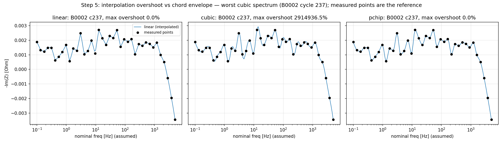
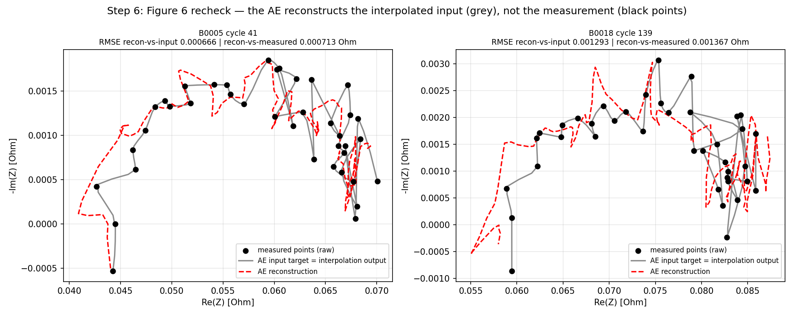

# Interpolation Re-evaluation + Figure 6 Recheck (Steps 5–6 of the 18-Step Sequence)

**Date:** 2026-09-23
**Scope:** Advisor Round 2 — Step 5 (A8: interpolation comparison with a quantitative overshoot measure) and Step 6 (Figure 6 recheck on the verified pipeline; Part H2).
**Prerequisite:** Steps 1–4 complete (`EIS_Raw_Verification.md`). All interpolation in this report uses the verified raw points; frequency positions remain the declared nominal assumption (A2).
**Data:** 887 verified spectra (34,593 points), B0005, B0006, B0007, B0018.

---

## Step 5: Interpolation methods compared with a quantitative overshoot measure

### Method definition (no visual judgment)

For every spectrum, each method interpolates the 39 measured points to a 128-point dense curve on the two grids used by the pipeline (linear grid and log grid over the nominal 0.1 Hz–5 kHz range). For each interval between two adjacent measured points, the **chord envelope** is [min(y_i, y_{i+1}), max(y_i, y_{i+1})]. A dense point outside this envelope is an **overshoot**. Two quantities are reported per spectrum:

1. **Max relative overshoot** = largest excursion outside the envelope, normalized by the chord height (or by the spectrum range when the chord is flat).
2. **Max absolute overshoot** in Ohm.

Aggregated over all 887 spectra × 2 components (Re_Z, Neg_Im_Z). The rebuilt curves were cross-checked against the pipeline files (`Interpolated_EIS_log_grid_pchip.pt`): max abs diff = 3.6e-9 Ohm — the metrics describe the pipeline's actual outputs.

### Results (mean ± std of per-spectrum max overshoot; max = worst spectrum)

| Grid | Method | Component | Rel. overshoot mean ± std | Abs. overshoot mean ± std (Ohm) | Worst abs. (Ohm) |
|---|---|---|---|---|---|
| linear | linear | Re_Z / Neg_Im_Z | 0 / 0 | 0 / 0 | 0 |
| linear | cubic | Re_Z | 3,153% ± 16,181% | 0.00085 ± 0.00081 | 0.00537 |
| linear | cubic | Neg_Im_Z | 9,726% ± 161,817% | 0.00025 ± 0.00023 | 0.00167 |
| linear | pchip | Re_Z / Neg_Im_Z | 0 / 0 | 0 / 0 | 0 |
| log | linear | Re_Z / Neg_Im_Z | 0 / 0 | 0 / 0 | 0 |
| log | cubic | Re_Z | 4,312% ± 19,679% | 0.00176 ± 0.00181 | **0.01117** |
| log | cubic | Neg_Im_Z | 7,545% ± 111,042% | 0.00046 ± 0.00054 | 0.00353 |
| log | pchip | Re_Z / Neg_Im_Z | 0 / 0 | 0 / 0 | 0 |

*Figure 4. Worst cubic spectrum (B0006, CSV cycle 237, -Im(Z)): measured points (black) vs Linear/Cubic/PCHIP on the nominal log grid. Cubic overshoots between points; PCHIP and Linear stay inside the chord envelope. Reference = measured points.*

### Findings

1. **PCHIP produces zero overshoot in all 1,774 checks** (887 spectra × 2 components × 2 grids). The earlier claim "PCHIP avoids the overshoot observed with Cubic Spline" is now supported by a measured quantity, not by visual inspection.
2. **Cubic Spline overshoots in all 3,548 checks** (887 spectra × 2 components × 2 grids). The mean max overshoot is 0.25–1.76 mOhm; the worst case reaches 11.2 mOhm on Re_Z. For scale: the entire reactive part of these spectra spans only ~1–6 mOhm (Steps 1–4), so a cubic overshoot can exceed the full -Im(Z) signal. The large relative percentages come from the small chord heights of this flat-arc data.
3. **Linear interpolation also shows zero overshoot** (it is the chord itself), but it is not smooth; the choice between Linear and PCHIP is therefore not about overshoot but about smoothness, which downstream metrics (Step 8) should decide.
4. The linear and log grids behave similarly for overshoot; the method choice dominates the distortion.

### Limitation

The chord-envelope measure quantifies local distortion relative to the measured points. It cannot validate the interpolation against unmeasured values between points — no ground truth exists there. Frequency positions remain the declared nominal assumption (A2); the envelope test itself depends only on the measured points, not on frequency values.

**Conclusion (hedged):** the results support keeping PCHIP as the shape-preserving candidate; the final Linear-vs-PCHIP decision should be made on downstream SOH metrics (Step 8), as the advisor requires.

---

## Step 6: Figure 6 recheck — what does the AE actually reconstruct?

### Protocol (replicates the original Figure 6 pipeline)

ControlledAutoencoder (256→128→17→128→256), trained on `log_grid + pchip`, MinMaxScaler fitted on Train (B0005+B0006) only, 300 epochs, MSE, lr=0.001, batch=16, seed=42, CPU. Fixed 300 epochs replicates the original protocol; EarlyStopping (Part I) belongs to the final pipeline (Step 17), not to this recheck.

### Quantitative recheck (physical units, Ohm, per spectrum RMSE, mean ± std)

| Battery (role) | n | AE recon vs interpolated input | AE recon vs measured points |
|---|---|---|---|
| B0005 (train) | 278 | 0.00076 ± 0.00019 | 0.00086 ± 0.00022 |
| B0006 (train) | 278 | 0.01031 ± 0.00164 | 0.01034 ± 0.00164 |
| B0007 (val) | 278 | 0.00118 ± 0.00063 | 0.00134 ± 0.00078 |
| B0018 (test) | 53 | 0.00107 ± 0.00028 | 0.00116 ± 0.00029 |

("Measured points" = the 39 verified raw points, compared at their nearest nominal-grid positions; the grid offset contributes < 0.1 mOhm.)

*Figure 5. Figure 6 recheck, B0005 cycle 41 and B0018 (mid-life): measured points (black markers), AE input target (grey = interpolation output, not measured data), AE reconstruction (red dashed). Reference = measured points.*

### Findings

1. **The logic chain of Part H2 is observed quantitatively:** AE reconstruction error against the measurement (0.86–10.3 mOhm) ≈ error against the interpolated input + ~0.1 mOhm. The AE reconstructs the interpolation; agreement with the measurement is limited by the reconstruction itself plus the small interpolation offset. A "good" reconstruction number therefore describes agreement with the interpolated input, not with the measured spectrum.
2. **The interpolation offset is small (~0.07–0.1 mOhm)** relative to the reconstruction error. On this dataset, the interpolation step is not the largest error source in Figure 6 — the reconstruction is. (This does not contradict Part H2; it quantifies it.)
3. **B0006 anomaly:** its reconstruction error (10.3 mOhm) is ~13× B0005's, although both are training batteries. One candidate explanation is the shared MinMaxScaler across the two training batteries: the wider-range battery occupies a larger scaled amplitude, so an equal scaled-space error becomes a larger Ohm error. This may be associated with the scaling scheme, not with the battery. Step 9–10 baselines (Raw EIS → BPNN, PCA → BPNN) will show whether this propagates to SOH prediction.

---

## Summary

| Step | Question | Answer with evidence |
|---|---|---|
| 5 | Does Cubic Spline overshoot on the verified data? | Yes — mean max 0.25–1.76 mOhm, worst 11.2 mOhm, in all 887 spectra |
| 5 | Is PCHIP overshoot-free? | Yes — 0 overshoot in all 1,774 checks (quantitative, not visual) |
| 5 | Linear vs PCHIP? | Both 0 overshoot; decide on downstream metrics (Step 8) |
| 6 | Does the AE reconstruct the measurement or the interpolation? | The interpolation (recon-vs-measured ≈ recon-vs-input + 0.1 mOhm); H2 chain quantified |
| 6 | Any new anomaly? | B0006 recon error 13× B0005; candidate cause = shared scaler; test in Steps 9–10 |

---

#
## Artifacts (`Autoencoder/eis_verify/`)

| File | Purpose |
|---|---|
| `step5_overshoot.py` | Overshoot computation over 887 spectra × 2 grids × 3 methods + cross-check vs `.pt` |
| `interpolation_overshoot_results.csv` | Per-config results (relative % + absolute Ohm) |
| `Step5_overshoot_worst_case.png` | Worst cubic spectrum, 3 methods, measured points as reference |
| `step6_fig6_recheck.py` | AE retraining (original protocol) + dual RMSE + recheck figure |
| `fig6_recheck_metrics.csv` | Per-battery recon-vs-input and recon-vs-measured RMSE |
| `Step6_Fig6_recheck.png` | 3-layer recheck figure (measured / AE input / AE reconstruction) |
| `Interpolation_Reeval.md` | This report |