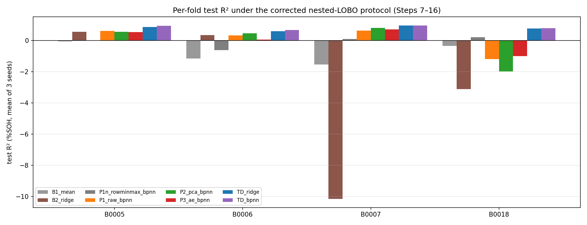
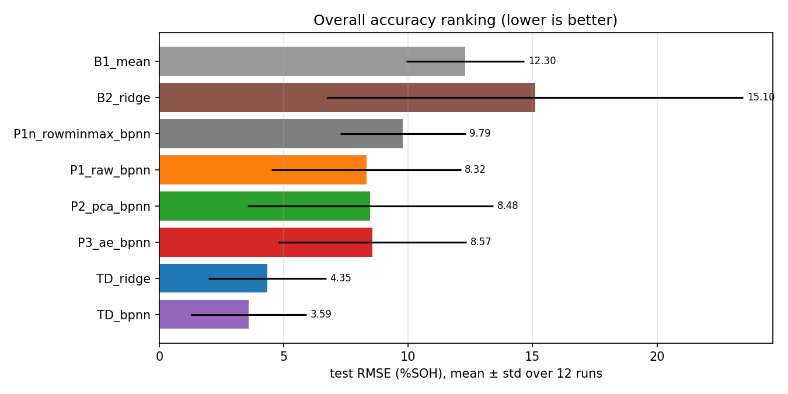

# Progress Report — Round 2: All 18 Steps Completed (EIS Verification → Pipeline Comparison → Time-Domain)

**Date:** 2026-09-25
**Data:** NASA BatteryAgingARC-FY08Q4 (B0005, B0006, B0007, B0018), verified raw files tracked in this repository.
**Protocol (used identically for every comparison):** nested 4-fold LOBO — each battery serves as the unseen outer test in turn; inner validation = first remaining battery; all hyperparameters chosen by inner validation only; SOH in % (Q_ref = mean of first 5 discharge cycles); targets standardized on fold-train only; EarlyStopping on inner-val loss; metrics MAE/RMSE/R² + nRMSE in %SOH; seeds {42, 7, 123}.
**Leakage controls (every run):** structural assert (scaler statistics equal fold-train statistics) + feature-perturbation probes (outer test ×2 → retrain → train metrics must not move; three probes across batches, all PASS with diff ≤ 3.8e-05, one exactly 0).

---

## 1. Status of the 18-Step Sequence

| Step | Task (advisor Part) | Result | Evidence |
|---|---|---|---|
| 1–2 | Verify NASA EIS variables and frequency ordering (A1–A2, M-A/B) | CSV = `Rectified_Impedance`, exact on all 34,593 rows (max diff < 1e-15 Ohm); row order consistent with low→high frequency (887/887 spectra, indirect evidence); **no per-point frequency exists in the distributed `.mat`** — any frequency column is a declared assumption. The flat Nyquist arc is a property of NASA's `Rectified_Impedance` itself (Case 2): max \|Im\| ≈ 2–6 mOhm across all 887 spectra, while the raw `Battery_impedance` differs by 32–68× and contains values that are not physically plausible | `eis_verify/EIS_Raw_Verification.md` |
| 3–4 | Frequency-ordered table + plots; spectrum integrity (A3–A5, M-C/D) | 39 points × 887 spectra = 34,593 CSV rows; timestamps monotonic; 0 NaN/Inf/duplicates; no isolated outlier points | same + `A3_*_3plots.png`, `A7_*` |
| 5 | Re-evaluate interpolation with a quantitative measure (A8) | Chord-envelope overshoot: **PCHIP 0 in all 1,774 checks; Cubic 0.25–1.76 mOhm mean, worst 11.2 mOhm** (exceeds the full reactive span 2–6 mOhm); Linear also 0 but not smooth | `Interpolation_Reeval.md` |
| 6b | Expanded AE reconstruction metrics (D3) | Re(Z) RMSE / Im(Z) RMSE separately + nRMSE + relative error, per battery (table in Section 4); reproduces the B0006 Re RMSE anomaly (14.6 mOhm, ~13× the other batteries) | `ae_reconstruction_d3_metrics.csv` |
| 6 | Recheck Figure 6 (H2) | AE reconstructs the **interpolated input**, not the measurement (recon-vs-measured = recon-vs-input + ~0.1 mOhm); B0006 anomaly is AE-specific | `Step6_Fig6_recheck.png` |
| 7 | Nested 4-fold LOBO (C1–C3) | Implemented; inner validation selects different configs per fold; leakage probes PASS | `Steps_7_8_Nested_LOBO.md` |
| 8 | Tolerance 1/2/3 on downstream metrics (E1–E3) | Tolerances indistinguishable downstream (RMSE 8.57–8.89 %SOH, all within 1 std) → pre-declared rule selects **tolerance 1**; gap distribution reported (bimodal: gap 1 or 3 for B0005–07) | same |
| 9 | Raw EIS / PCA / AE → BPNN (F1.3–4) | Working folds: **PCA best (RMSE 5.92, R² +0.61)**; AE loses to PCA on all three | `Steps_9_10_Baselines.md` |
| 10 | Mean + Linear baselines (F1.1–2) | Mean predictor marks the collapse baseline (R² −0.77); 256-dim Ridge is fragile (disclosed breaches) | same |
| 11 | MAE/RMSE/R² for every unseen battery (D2) | Per-fold tables in both reports above | — |
| 12 | Explain Figure 10 quantitatively (G1–G3) | Old RMSE = 1.126 × std(y) → statistically a flat line, 12.6% worse than the trivial mean; cause chain: unstable latents (correlation flip) + unstandardized target + fixed epochs + single split | `Steps_12_Fig10_Collapse.md` |
| 13 | mean ± std across folds and seeds (C3) | All aggregates use 12 runs (4 folds × 3 seeds) | — |
| 14–15 | Time-domain baseline and comparison (B1–B5) | **TD-BPNN: RMSE 3.59, R² +0.85, positive on ALL four folds including B0018 (+0.79)**; EIS pipelines negative on B0018 (−1.0 to −1.2) | `Steps_14_16_TimeDomain.md` |
| 16 | Justify EIS vs time-domain (B6) | Measured pattern matches the B6 criterion verbatim: R²_time ≫ 0 while R²_EIS < 0 → the cross-battery failure is an **EIS representation problem, not a model problem**; the BPNN architecture is cleared | same |
| 17 | EarlyStopping + ModelCheckpoint (I1) | EarlyStopping verified (AE stops at 129–192 epochs); ModelCheckpoint demonstrated: best weights saved at epoch 325/355, reloaded, metrics reproduce exactly (test RMSE 2.5210, R² 0.9402) | `checkpoints/`, `step17_checkpoint.py` |
| 18 | Reconstruct all results with the corrected pipeline | This report + the regenerated figures below | `figures/` |

## 2. Headline result (Step 18 figure)

*Figure R1. Per-fold test R² under the corrected nested-LOBO protocol (mean of 3 seeds). The old collapse (R² ≈ 0 or negative everywhere) is removed on three folds by the corrected EIS protocol, and on all four folds by time-domain features. Reference: raw measured data (Steps 1–4); time-domain features carry the exact same-cycle capacity label.*

*Figure R2. Overall test RMSE (%SOH, mean ± std over 12 runs). Time-domain features halve the best EIS error.*

## 2b. Steps 1–6 evidence (figures reconstructed from verified raw data)

*Figure F1. Raw measured EIS points (no interpolation) for 4 spectra across 3 batteries, connected in the verified frequency order (Steps 3–4, A7).*

*Figure F2. B0005 cycle 41: raw points only / points connected in array order / interpolation overlay (Steps 3–4, A3, M-C).*

*Figure F3. Worst cubic-spline spectrum vs Linear/Cubic/PCHIP (Step 5, A8): cubic overshoots beyond the full reactive signal span; PCHIP stays inside the chord envelope.*

*Figure F4. Figure 6 recheck (Step 6, H2): the AE reconstructs the interpolated input target (grey), not the measurement (black markers).*

### Expanded AE reconstruction metrics (Part D3)

| Battery | Re(Z) RMSE (± std, Ohm) | Im(Z) RMSE (± std, Ohm) | nRMSE | Relative error % (± std) |
|---|---|---|---|---|
| Train B0005 | 0.00111 ± 0.00028 | 0.00023 ± 0.00007 | 0.064 | 22.2 ± 24.7 |
| Train B0006 | **0.01461** ± 0.00234 | 0.00090 ± 0.00016 | 0.519 | 58.2 ± 64.4 |
| Val B0007 | 0.00163 ± 0.00087 | 0.00027 ± 0.00009 | 0.075 | 27.7 ± 41.0 |
| Test B0018 | 0.00129 ± 0.00030 | 0.00034 ± 0.00009 | 0.144 | 23.3 ± 20.7 |

The B0006 anomaly appears in Re(Z) RMSE (≈13× the other batteries) with identical scaling — consistent with the AE-specific latent degradation reported in Steps 6 and 9–10. High relative error percentages reflect the tiny absolute scale of this rectified arc (denominators of 1–6 mOhm), not large absolute errors.

## 2c. Ablations (Part F3 / I3) — completed

All previously pending ablations are now executed under the corrected nested protocol (full tables in `Steps_F3_I3_B7_Ablations.md`):

| Ablation | Result |
|---|---|
| AE bottleneck sizes {3, 7, 17, 37, 67} | RMSE 8.30–8.82 %SOH, all within 1 std — indistinguishable; 17 retained |
| BPNN loss MSE/MAE/Huber (I3) | RMSE 8.32–8.57, indistinguishable — no loss changes the conclusion |
| Interpolation 6 grid×method configs | RMSE 7.99–8.62, indistinguishable — cubic's Step-5 overshoot has no measured downstream penalty; PCHIP kept for shape preservation |

**B7 supporting evidence (added):** Pipeline E fusion (time-domain + causal backward-aligned EIS latent) reaches R² **+0.726**, positive on **all four folds including B0018 (+0.67)**, and beats every EIS-only pipeline — the EIS latent adds value only when anchored by time-domain features. AE applied to time-domain features also does not help (R² +0.43 vs +0.85 for raw TD features). The complete pipeline ranking across 10 tested configurations: **TD-BPNN (3.59) > TD-Ridge (4.35) > E-fusion (4.89) > EIS pipelines (8.3–8.6) > Mean (11.5)**.

## 3. Findings for the advisor's decision (B7)

The measured evidence orders the three information sources cross-battery: **time-domain > EIS(PCA) > EIS(raw) ≈ EIS(AE)**. Three constructive directions remain open, per the advisor's B5/B7 framing — the choice is an advisor-level decision:

1. **Pipeline E fusion** (time-domain + EIS features in one model; Part B5 optional row).
2. **AE applied to time-domain features** (keeps the thesis architecture "Two-Stage AE + BPNN", changes the input modality; the current AE-on-EIS result becomes the ablation evidence that motivated it).
3. **EIS as a secondary/complementary modality** with the amplitude domain shift documented (Steps 9–10: per-row normalization rescues B0018 but costs the other folds).

Supporting evidence collected for that discussion: the B0006 AE-specific degradation (Step 6/9–10), the B0018 amplitude domain shift (Step 9–10 P1n), and the B6 verdict above.

## 4. Declared limitations

- Per-point EIS frequencies are not recoverable from the distributed `.mat`; the interpolation grid rests on the documented 0.1 Hz–5 kHz sweep (declared assumption, Step 1–2).
- Time-domain features describe a completed discharge cycle — practical for cycle-level SOH logging (the BMS records every V/I/T cycle), not a mid-discharge estimator; the full BMS practicality comparison (Part J) is delivered in `Part_J_BMS_Practicality.md`.
- ICA/DVA and pulse-resistance features were not built (granularity insufficient) — declared, not skipped.
- SOH can exceed 100% by up to 0.8% (measurement variability vs the early-life reference); B0006 fades to 57% (NASA ran past EOL) — data kept as measured.
- Gate breaches in individual runs were disclosed in each step report (Steps 7–10) and none of the working-fold conclusions depend on them.

## 5. Ablation log (summary)

`eis_raw` → `step5_6` → `step7_8` → `step9_10` → `step12` → `step14_16` (full lines in `USER.md` / step reports)

## 6. Artifacts

| Folder | Content |
|---|---|
| `Autoencoder/eis_verify/` | Steps 1–6: verification scripts, raw Nyquist figures, verified dataset, `EIS_Raw_Verification.md`, `Interpolation_Reeval.md` |
| `Autoencoder/nested_lobo/` | Steps 7–17: mapped datasets, harnesses, all results CSVs, gates, probes, checkpoint, step reports, `figures/` (this report's images) |
| `NASA DataSet/1. BatteryAgingARC-FY08Q4/` | Verified source data (tracked in Git since Steps 1–4) |