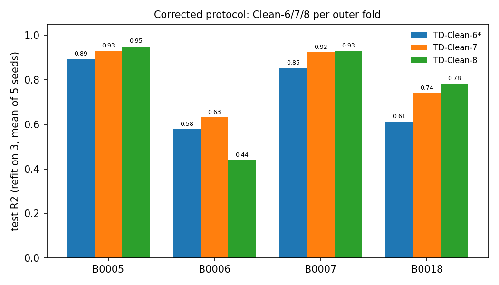
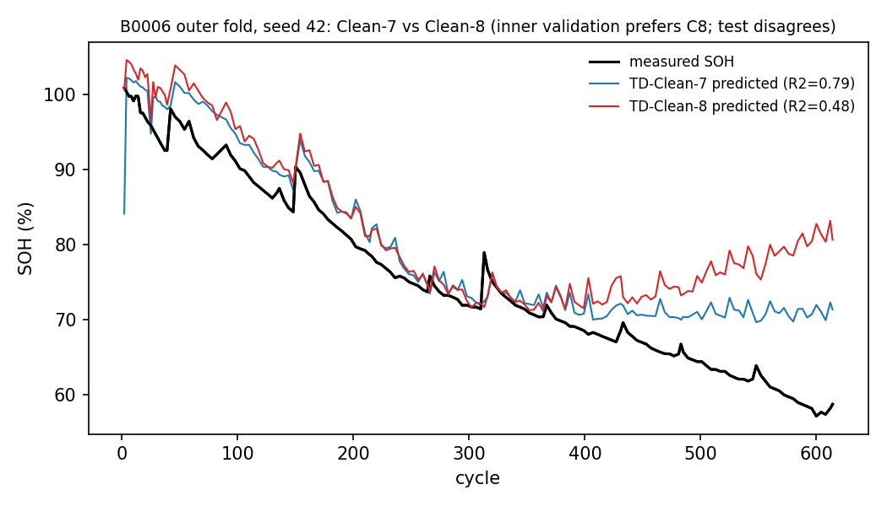

# Round 4 progress report: protocol verification and corrections

Date: 2026-10-10
Author: Padipat Aincham (M11452803)
Repository: github.com/DomIncham/soh-thesis-ae-bpnn (branch `main`, commits `aea8cf4..817ea88`)

This report answers the six points in your Round 4 comment. All re-runs use CPU, the same
data files as Round 3, and the committed seed sets. A structural verification suite now
guards the protocol (Section 4); it passes 25/25 at the time of writing.

All files referenced below are linked to the repository at the current head
(`70d7a7b`): https://github.com/DomIncham/soh-thesis-ae-bpnn/blob/main/Autoencoder/round3_phase1/

Abbreviated paths in this report are relative to `Autoencoder/round3_phase1/`.

## 1. Nested LOBO implementation

I checked the inner loop against your example line by line and found two mismatches. First, the inner loop rotated over only two
batteries. With B0005 as the outer test battery, the inner folds validated on B0007 and B0018
only. B0006, the third training battery, was never used as inner validation. The rotation now
covers all three training batteries, so for outer B0005 the folds are as you specified:
validate B0006 (train B0007+B0018), validate B0007 (train B0006+B0018), validate B0018 (train
B0006+B0007).

Second, model selection used a single validation battery rather than the aggregated three-fold
score. Each candidate architecture is now scored by the mean validation RMSE over the three
inner folds, each fold with its own training scaler. The refit stage is unchanged: the selected
configuration is re-fitted on all three remaining batteries and tested on the untouched outer
battery.

One selection rule from Round 3 is kept: a candidate counts as converged only if its
early-stopping epoch is at least 20 in all three inner folds (the guard introduced after the
`sel_epochs=1` failure in the R3-C1 audit). This rule is stricter than plain aggregation. Where
no candidate converges, the best candidate is retrained for a fixed 200 epochs and the fold is
marked `sel_degenerate` in the result files. I kept this rule because it prevents a known
failure mode; it is documented per fold in every results CSV.

Corrected results (test R², refit stage, mean over 5 seeds, inner 3-fold LOBO). The Before
column is the committed Round 2/3 value (TD-All, Proxy-Free, Oracle: 3 seeds; Clean sets:
5 seeds; single inner validation):

| Feature set | Before (Round 2 protocol, single inner validation) | After (corrected) | Change |
|---|---|---|---|
| TD-All (8 features) | 0.923 | 0.923 | no change |
| Clean-6 (636-row set) | 0.490 | 0.601 | +0.111 |
| Clean-7 (631-row set) | 0.772 | 0.807 | +0.035 |
| Clean-8 (631-row set) | 0.810 | 0.776 | −0.034 |
| Clean-4 (636-row set) | −0.400 | −0.349 | +0.051 |
| TD-Proxy-Free | 0.854 | 0.874 | +0.020 |
| Oracle-proxy | 0.663 | 0.655 | −0.008 |

Figure 1. Test R² of Clean-6*, Clean-7 and Clean-8 (631-row set) on each outer battery under
the corrected protocol (mean of 5 seeds). Plotted from
[`phase3_charge_r4_results.csv`](https://github.com/DomIncham/soh-thesis-ae-bpnn/blob/main/Autoencoder/round3_phase1/phase3_charge_r4_results.csv)
(the 2026-10-10 corrected-protocol run, refit stage). Clean-6 gains the most from the
correction; on B0006 the Clean-8 result drops below Clean-7, which Section 1.1 explains.

### 1.1 New finding: the Clean-8 gain does not survive the correction

Under the old protocol, adding t_40_41 to Clean-7 improved test R² from 0.772 to 0.810. Under
the corrected protocol this reverses: Clean-7 0.807, Clean-8 0.776. Three observations support
that this is a property of the data, not an implementation error:

1. The inner-validation RMSE ranks Clean-8 best (3.69 vs 4.55 for Clean-7 on the B0006 fold,
   mean over seeds), while its outer-test R² on the same fold is the worst (0.44 vs 0.63). The
   feature helps predict the training batteries but not the held-out one.
2. The drop concentrates on B0006 (Clean-8 minus Clean-7 spans −0.008 to −0.36 across the five
   seeds, negative in all five); on the other three batteries the mean difference is small and
   positive (0.006 to 0.043).
3. A selection-free ridge probe on the same rows and folds shows the same direction: adding
   t_40_41 lowers held-out R² on every battery by a small margin (for example B0018 0.66 → 0.60).
   The probe script is `r4_ridge_probe.py`.

I therefore treat the earlier Clean-8 gain as a selection-variant effect and report Clean-7 as
the strongest proxy-audited feature set. Figure 2 shows the B0006 fold.

Figure 2. B0006 outer fold (seed 42). The Clean-8 model (red) follows the measured curve less
well than Clean-7 (blue) after cycle 300, although it scored better in inner validation.
Plotted from the per-cycle predictions in
[`phase3_charge_r4_preds.csv`](https://github.com/DomIncham/soh-thesis-ae-bpnn/blob/main/Autoencoder/round3_phase1/phase3_charge_r4_preds.csv)
(same run as Figure 1, refit stage).

## 2. CALCE Clean-6T feature definition

You were right. The four CALCE scripts labelled Clean-6T still contained dis_duration and
dis_mean_V, the two proxy/proxy-equivalent features from the R3-C3 audit. The correct
definition, Clean-8 without the two temperature features unavailable in CALCE, is the six
features: dis_V_slope, cc_dur, cv_dur, cv_I_slope, t_40_41, ic_peak_V.

All four scripts now use this list, and the structural check S4 fails with a non-zero exit if
either proxy feature re-enters. Corrected results (test R², 5 seeds; the transfer rows report
the median because the per-cell scores are skewed, the within row reports mean and
median):

| Experiment | Before (with the two proxy features) | After (corrected Clean-6T) | Conclusion unchanged? |
|---|---|---|---|
| Frozen NASA → CALCE (room pool) | median −37 | median −2.8 | No: consistent with domain shift (the target ranges do not overlap) rather than proxy leakage; the direction is the same (transfer does not work) |
| Frozen NASA → CALCE (all-13 pool) | −48 | −92 | No |
| One-cell scratch training | median −68 | median −52 | No: adaptation does not recover transfer |
| One-cell warm adaptation | median −31 | median −0.9 | No |
| Within-CALCE LOCO control | mean 0.235 | mean 0.158, median 0.573 | No: removing the two features changes the median from 0.589 to 0.573 |

The main change is in the explanation rather than the direction. After the correction,
within-CALCE performance stays close to the 8-feature median (0.573 vs 0.589), so the two
removed features were not carrying most of the accuracy. For transfer, the model does not cross the datasets because
the target ranges do not overlap: NASA training SOH spans 57–101% while CALCE CS2 spans
87–113%, and five of the six features fall outside the NASA min–max range on most CS2 cycles
(for example cc_dur exceeds the NASA maximum on 93% of CS2 rows; ic_peak_V and cv_dur sit
below the NASA minimum on 41% and 62% of rows). Under the
corrected feature set this is the plain statement: NASA→CALCE transfer is not viable without
target-range alignment or domain adaptation.

## 3. Source-model validation procedure

The required sequence, selection on a fitting set that excludes the validation battery, then a
final refit on all available source-training batteries, then testing on the untouched target,
is now identical in all five run scripts:

| Script | Selection fitting set | Refit set | Test |
|---|---|---|---|
| NASA nested LOBO (r3common.run_fold) | 2 batteries per inner fold (the inner validation rotates over all 3 training batteries) | 3 batteries | outer battery |
| Frozen NASA → CALCE (transfer) | pool minus 1 validation battery | full pool | each CS2 cell |
| One-cell scratch (adapt1) | pool minus 1 validation battery | full pool, then fine-tune on 1 CS2 cell | other 7 cells |
| One-cell warm (adapt2) | pool minus 1 validation battery | full pool, then warm-start on 1 CS2 cell | other 7 cells |
| Within-CALCE LOCO (within) | 6 cells (validation excluded) | 7 cells | held-out cell |

I verified the disjointness with the structural checks (Section 4) and by re-running one selection step
in-process: the recorded configuration and test scores reproduce.

One question for you. Your item 1 specifies the three-fold rotation for the NASA nested LOBO.
The CALCE selection stages use one validation battery per fold (drawn by seed), with
the same disjoint-then-refit sequence. Should the rotation also be applied there? I read your
rerun list as covering the NASA settings, so I did not change the CALCE selection style. If it
should rotate as well, I will rerun those arms; the estimated extra cost is about one hour.

## 4. Structural verification suite

The suite lives in `Autoencoder/round3_phase1/round4_structural_verify.py`. It exits with code
1 when any check fails, so a definition that drifts away from the implementation stops the
workflow. I will run the suite before every future experiment batch.
Current status: all 25 checks pass.

| Check | What it establishes |
|---|---|
| S1 | the inner loop contains three validation folds (verified by intercepting the training calls, not by reading the code) |
| S2 | training and validation batteries are disjoint in every recorded selection fold |
| S2b | the within-CALCE results are complete (5 seeds × 8 cells), contain no duplicated rows, and validation never equals the test cell |
| S3 | the declared feature set matches the columns passed to the model in all four CALCE scripts |
| S4 | dis_duration and dis_mean_V are absent from every proxy-audited feature set, in the scripts and in the shared feature constants |
| S5 | the four CALCE scripts declare identical feature lists |

## 5. Autoencoder

No AE file was touched in this round (git log `c5ddbd4..817ea88`). The AE remains a
documented negative result.

## 6. Next steps

Per your instruction I have not started any of the four candidate directions. The corrected
results and the before/after table above are ready for your review. Two points that may affect
the choice:

1. Clean-6 (0.60) sits below the 7-feature reference (0.874), so the cost of removing the last
   proxy-equivalent feature is now measured under a stricter protocol. The two sets differ by
   exactly one feature: TD-Proxy-Free still contains dis_mean_V, which our R3-C3 audit
   classifies as proxy-equivalent, so it is proxy-free only by the Round 2 definition.
2. The NASA→CALCE gap is a range problem as much as a feature problem (SOH 57–101% vs 87–113%,
   measured from the two feature files). This is an observation, not a tested cause; if the
   domain-shift direction is chosen, a range-alignment step would be the first thing to test.

## Summary of files changed

All at `Autoencoder/round3_phase1/` on `main`:

- [`r3common.py`](https://github.com/DomIncham/soh-thesis-ae-bpnn/blob/main/Autoencoder/round3_phase1/r3common.py):
  inner LOBO correction (3-fold rotation), default switched to `lobo3`
- [`phase4_cs2_transfer.py`](https://github.com/DomIncham/soh-thesis-ae-bpnn/blob/main/Autoencoder/round3_phase1/phase4_cs2_transfer.py),
  [`phase4_cs2_adapt1.py`](https://github.com/DomIncham/soh-thesis-ae-bpnn/blob/main/Autoencoder/round3_phase1/phase4_cs2_adapt1.py),
  [`phase4_cs2_adapt2.py`](https://github.com/DomIncham/soh-thesis-ae-bpnn/blob/main/Autoencoder/round3_phase1/phase4_cs2_adapt2.py),
  [`phase4_cs2_within.py`](https://github.com/DomIncham/soh-thesis-ae-bpnn/blob/main/Autoencoder/round3_phase1/phase4_cs2_within.py):
  corrected Clean-6T feature list, disjoint selection, full-pool refit, validation battery recorded
- [`td_proxy_audit.py`](https://github.com/DomIncham/soh-thesis-ae-bpnn/blob/main/Autoencoder/round3_phase1/td_proxy_audit.py):
  five seeds to match the committed baseline
- [`round4_structural_verify.py`](https://github.com/DomIncham/soh-thesis-ae-bpnn/blob/main/Autoencoder/round3_phase1/round4_structural_verify.py):
  new structural suite
- Corrected result files:
  [`td_clean_cpu_results.csv`](https://github.com/DomIncham/soh-thesis-ae-bpnn/blob/main/Autoencoder/round3_phase1/td_clean_cpu_results.csv),
  [`td_proxy_audit_r4full5_results.csv`](https://github.com/DomIncham/soh-thesis-ae-bpnn/blob/main/Autoencoder/round3_phase1/td_proxy_audit_r4full5_results.csv),
  [`phase3_charge_r4_results.csv`](https://github.com/DomIncham/soh-thesis-ae-bpnn/blob/main/Autoencoder/round3_phase1/phase3_charge_r4_results.csv),
  [`phase4_cs2_within_full.csv`](https://github.com/DomIncham/soh-thesis-ae-bpnn/blob/main/Autoencoder/round3_phase1/phase4_cs2_within_full.csv),
  [`phase4_cs2_transfer_full.csv`](https://github.com/DomIncham/soh-thesis-ae-bpnn/blob/main/Autoencoder/round3_phase1/phase4_cs2_transfer_full.csv),
  [`phase4_cs2_adapt1_full.csv`](https://github.com/DomIncham/soh-thesis-ae-bpnn/blob/main/Autoencoder/round3_phase1/phase4_cs2_adapt1_full.csv),
  [`phase4_cs2_adapt2_full.csv`](https://github.com/DomIncham/soh-thesis-ae-bpnn/blob/main/Autoencoder/round3_phase1/phase4_cs2_adapt2_full.csv)
- Figures in this report:
  [`r4_fig_clean_sets.png`](https://github.com/DomIncham/soh-thesis-ae-bpnn/blob/main/Autoencoder/round3_phase1/r4_fig_clean_sets.png),
  [`r4_fig_b0006_c7_c8.png`](https://github.com/DomIncham/soh-thesis-ae-bpnn/blob/main/Autoencoder/round3_phase1/r4_fig_b0006_c7_c8.png)
- Commits of this round: [`aea8cf4..817ea88`](https://github.com/DomIncham/soh-thesis-ae-bpnn/commits/main)
