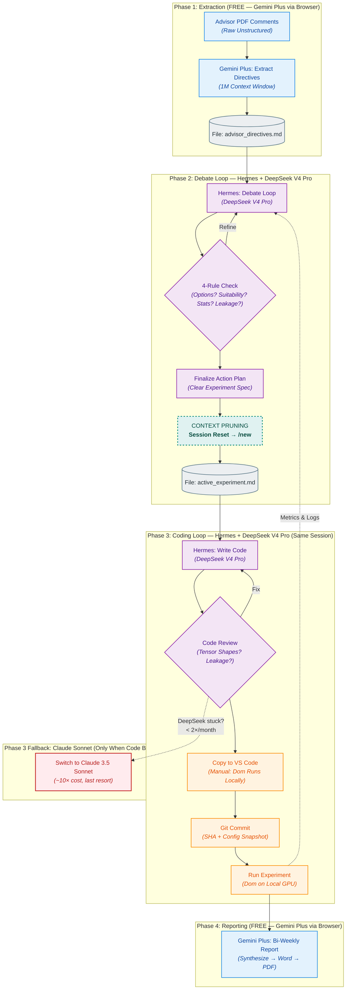

# End-to-End Research Workflow & Budget — DeepSeek V4 Pro Edition

> **Monthly Budget:** 500 THB (~$14) บน OpenRouter Pay-as-you-go  
> **Actual Usage:** ~$2-4/month (DeepSeek 100%) → เหลือ headroom ~$10-12/month สำหรับ burst/marathon

---

## 1. Flowchart ภาพรวม

---

## 2. สรุปค่าใช้จ่ายตามเฟส (Real Budget — DeepSeek V4 Pro)

| Phase | ชื่องาน | โมเดล | Cost/Session | Sessions/Month | รวม/เดือน |
| :--- | :--- | :--- | :--- | :--- | :--- |
| **P1** | Extraction | Gemini Plus (Browser) | **$0.00** | — | $0.00 |
| **P2** | Debate Loop | DeepSeek V4 Pro (Hermes) | ~$0.030 | 25-40 | ~$0.75-1.20 |
| **P3** | Coding Loop | DeepSeek V4 Pro (Hermes) | ~$0.012 | 25-40 | ~$0.30-0.48 |
| **P3F** | Code Fallback | Claude 3.5 Sonnet | ~$0.15 | 1-2 | ~$0.15-0.30 |
| **P4** | Bi-Weekly Report | Gemini Plus (Browser) | **$0.00** | 2 | $0.00 |
| | | | | **Total** | **~$1.20-2.00** |

> **Monthly total ≈ 42-70 THB** — DeepSeek V4 Pro ถูกมาก ไม่ต้องกังวลเรื่อง budget เลย  
> Headroom: ~430-458 THB เหลือไว้ใช้ burst/marathon/fallback

### DeepSeek V4 Pro Pricing (OpenRouter)

| | $/1M tokens |
|---|---|
| Input | ~$0.35 |
| Output | ~$0.90 |

### ต่อ 1 Session (80:20 Debate:Coding)

| Phase | Input Tokens | Output Tokens | Cost |
|---|---|---|---|
| Debate (~40 turns) | 60K | 10K | ~$0.030 |
| Code (~10 turns) | 20K | 5K | ~$0.012 |
| **รวม** | **80K** | **15K** | **~$0.042** |

---

## 3. รายละเอียดเชิงลึกของแต่ละขั้นตอน

### Phase 1: Extraction (FREE — Gemini Plus Web Browser)

#### 1. Advisor's PDF Comments
- **Input:** ไฟล์ PDF พร้อมคอมเมนต์จากอาจารย์
- **Tool:** Gemini Plus (บัญชีส่วนตัว, Web Browser)
- **Cost:** $0.00 (ฟรีใน subscription)
- **Output:** `advisor_directives.md` — Single Source of Truth
- **Key advantage:** 1M context → ย่อย PDF ยาวๆ ได้ในครั้งเดียว

#### 2. `advisor_directives.md`
- ไฟล์ Git-tracked เก็บข้อกำหนดอาจารย์ทั้งหมด
- แปลงคอมเมนต์กระจัดกระจาย → Technical Directives ที่ชัดเจน
- ใช้เป็น input สำหรับ Phase 2 ทุกครั้ง

---

### Phase 2: Debate Loop (Hermes + DeepSeek V4 Pro)

#### 3. Hermes: Debate Loop
- **โมเดล:** DeepSeek V4 Pro (ผ่าน OpenRouter)
- **Input:** `advisor_directives.md` + ผลรันครั้งก่อน (ถ้ามี)
- **กระบวนการ:** ถกเถียง methodology ตาม 4 Rules:
  1. มี options อะไรบ้างที่พิจารณา?
  2. ทำไม option นี้ถึงเหมาะสม?
  3. มีหลักฐานทางสถิติอะไร support?
  4. Leakage? Generalization? Real-time feasibility?
- **Output:** Actionable Experiment Plan

#### 4. 4-Rule Challenge Gate
- ตรวจสอบแผนก่อนผ่านไป Phase 3
- ถ้าไม่ผ่าน → วนกลับ Debate
- ถ้าผ่าน → Finalize + Context Pruning

#### 5. ⚠️ CONTEXT PRUNING (Session Reset)
- **สำคัญ:** ก่อนเข้า Phase 3 — reset session ด้วย `/new`
- สรุปทุกอย่างลง `active_experiment.md` (state card)
- **ไม่ต้อง dump context debate ทั้งหมดให้โมเดลเสียเงิน**

#### 6. `active_experiment.md`
- ไฟล์ state card: experiment config, parameters, hypotheses
- กระชับ — input ให้ Phase 3 โดยไม่ต้องลาก context debate ยาวๆ

---

### Phase 3: Coding Loop (Hermes + DeepSeek V4 Pro)

#### 7. Hermes: Write Code
- **โมเดล:** DeepSeek V4 Pro (90%+) — เก่งพอสำหรับ PyTorch/ML
- **Input:** `active_experiment.md` (context สั้น)
- **Output:** Python scripts, configs, code diffs
- **PAEV Workflow:** Plan → Dom Approves → Execute → Verify

#### 8. Code Review Gate
- ตรวจ Tensor Shapes, Data Splits (LOBO), Leakage, Parameter Logic
- ผ่าน → ส่งให้ Dom copy ไป VS Code
- ไม่ผ่าน → แก้ไข (DeepSeek) หรือ fallback Claude Sonnet

#### 9. Fallback: Claude 3.5 Sonnet (เฉพาะโค้ดพัง)
- **Trigger:** DeepSeek แก้โค้ดไม่ได้ซ้ำ 2-3 ครั้ง
- **Cost:** ~$0.15/ครั้ง (~10× DeepSeek)
- **ความถี่:** ≤ 2 ครั้ง/เดือน
- **วิธีใช้:** `/model claude-sonnet` ใน Hermes → debug → กลับมา DeepSeek

#### 10. VS Code — Dom Runs Locally
- Dom copy โค้ดจาก Hermes → VS Code
- รัน Python บนเครื่องตัวเอง (Local GPU)
- ส่ง Terminal Output + CSV + รูปกลับมาให้ Capi วิเคราะห์

#### 11. Git Commit
- ทุกครั้งก่อนรัน → commit พร้อม config snapshot
- Reproducibility 100%

#### 12. Run Experiment
- Dom รันบน Local GPU
- Output: Loss curves, metrics, TensorBoard logs
- **Feedback →** ผลลัพธ์ย้อนกลับไป Phase 2 Debate Loop

---

### Phase 4: Reporting (FREE — Gemini Plus Web Browser)

#### 13. Bi-Weekly Report
- **Tool:** Gemini Plus (บัญชีส่วนตัว)
- **Input:** Logs + metrics + `advisor_directives.md`
- **Output:** Word → Export PDF → ส่งอาจารย์
- **Style:** English A2-B1, evidence-first, no overclaiming

---

## 4. Budget Summary (Monthly)

| Scenario | Sessions | Cost (USD) | Cost (THB) | % of 500 THB Budget |
|---|---|---|---|---|
| Light (3 days/wk) | 15 | $0.63 | ~22 ฿ | 4.4% |
| Normal (4 days/wk) | 25 | $1.05 | ~37 ฿ | 7.4% |
| Heavy (5 days/wk) | 40 | $1.68 | ~59 ฿ | 11.8% |
| Marathon bursts (+2×6hr) | 60 | $2.52 | ~88 ฿ | 17.6% |
| Max burst (+4×6hr) | 80 | $3.36 | ~118 ฿ | 23.6% |

> **Even at max usage: ยังต่ำกว่า 25% ของงบ 500 THB** — มีเงินเหลือเฟือสำหรับ fallback Claude Sonnet หรือ burst sessions

---

## 5. Execution Rules

1. **PAEV ทุกครั้ง:** Plan → Dom Approves 1× → Execute batch → Verify
2. **4 Rules** — defense methodology ทุกการตัดสินใจ
3. **Context Pruning** — `/new` ระหว่าง Phase 2→3
4. **Git commit** ก่อนรันทุกครั้ง
5. **Ablation Log** — append ทุก experiment
6. **Hybrid execution:** Capi runs scripts <50 lines; Dom runs GPU training
7. **Token hygiene:** ตอบสั้น ตรงประเด็น — ไม่ verbose